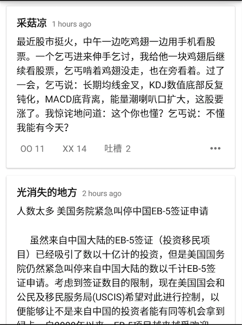

# Mredrock_Exam
移动开发部考核文档

## Android
### 必做题
- 按照以下要求独立完成一个APP：
	- 类似以下界面，顶部actionbar或者toolbar放APP图标，APP名字（`需要右上角的overflow`，`不`需要search button）  
	
	- 使用ViewPager＋Fragment，写三个界面：
		- 界面1: title：妹子图，点击每项列表的item，打开一个新界面全屏显示该item的图片
		
		- 界面2: title：段子，点击每项列表的item，打开一个新界面全屏显示该item的详细内容
		
		- 界面3: title：NONE，本界面自定义，作为加分项

- API：
	<pre><code>
	http://jandan.net/
	</code></pre>
	方式：get
	<pre><code>
	1.段子
	参数 ： oxwlxojflwblxbsapi 值： jandan.get_duan_comments
	参数 ： page 值： 1 （可选）
	eg：http://jandan.net/?oxwlxojflwblxbsapi=jandan.get_duan_comments&page=1
		{
		    "status": "ok",
		    "current_page": 1,
		    "total_comments": 9287,
		    "page_count": 372,
		    "count": 25,
		    "comments": [
		        {
		            "comment_ID": "2786387",
		            "comment_post_ID": "55592",
		            "comment_author": "光消失的地方",
		            "comment_author_email": "aqua5200@qq.com",
		            "comment_author_url": "",
		            "comment_author_IP": "1.60.229.254",
		            "comment_date": "2015-05-10 23:50:46",
		            "comment_date_gmt": "2015-05-10 15:50:46",
		            "comment_content": "棍棒底下出孝子，看来这句传统老话也过时了，应该改成朋友圈里出孝子",
		            "comment_karma": "0",
		            "comment_approved": "1",
		            "comment_agent": "Mozilla/5.0 (Windows NT 6.1; WOW64) AppleWebKit/537.36 (KHTML, like Gecko) Chrome/38.0.2125.122 Safari/537.36",
		            "comment_type": "",
		            "comment_parent": "0",
		            "user_id": "0",
		            "comment_subscribe": "N",
		            "comment_reply_ID": "0",
		            "vote_positive": "2",
		            "vote_negative": "2",
		            "text_content": "棍棒底下出孝子，看来这句传统老话也过时了，应该改成朋友圈里出孝子",
		            "videos": []
		        },
		        {
		            "comment_ID": "2786386",
		            "comment_post_ID": "55592",
		            "comment_author": "大奔叔",
		            "comment_author_email": "183111872@qq.com",
		            "comment_author_url": "",
		            "comment_author_IP": "223.145.169.180",
		            "comment_date": "2015-05-10 23:50:09",
		            "comment_date_gmt": "2015-05-10 15:50:09",
		            "comment_content": "若干年后的父亲节，当我看到我儿子在社交网站发的“爸，您辛苦了，节日快乐，我爱您”之类的话，后面还附上一张未经筛选的我的照片的时候，我不知我是该高兴还是该无奈。",
		            "comment_karma": "0",
		            "comment_approved": "1",
		            "comment_agent": "Mozilla/5.0 (Linux; Android 4.4.2; LG-D802 Build/KOT49I.D80220a) AppleWebKit/537.36 (KHTML, like Gecko) Version/4.0 Chrome/30.0.0.0 Mobile Safari/537.36",
		            "comment_type": "",
		            "comment_parent": "0",
		            "user_id": "0",
		            "comment_subscribe": "N",
		            "comment_reply_ID": "0",
		            "vote_positive": "7",
		            "vote_negative": "0",
		            "text_content": "若干年后的父亲节，当我看到我儿子在社交网站发的“爸，您辛苦了，节日快乐，我爱您”之类的话，后面还附上一张未经筛选的我的照片的时候，我不知我是该高兴还是该无奈。",
		            "videos": []
		        },
		        ...
		}
	</code></pre>
	<pre><code>
	2.妹子图
	参数 ： oxwlxojflwblxbsapi 值： jandan.get_ooxx_comments
	参数 ： page 值： 1 （可选） 
	eg：http://jandan.net/?oxwlxojflwblxbsapi=jandan.get_ooxx_comments&page=1	
		{
		    "status": "ok",
		    "current_page": 1,
		    "total_comments": 35021,
		    "page_count": 1401,
		    "count": 25,
		    "comments": [
		        {
		            "comment_ID": "2786357",
		            "comment_post_ID": "21183",
		            "comment_author": "summmmmmmer",
		            "comment_author_email": "1174820738@qq.com",
		            "comment_author_url": "",
		            "comment_author_IP": "222.137.5.120",
		            "comment_date": "2015-05-10 23:24:01",
		            "comment_date_gmt": "2015-05-10 15:24:01",
		            "comment_content": "",
		            "comment_karma": "0",
		            "comment_approved": "1",
		            "comment_agent": "Mozilla/5.0 (Windows NT 6.1; WOW64) AppleWebKit/537.36 (KHTML, like Gecko) Chrome/42.0.2311.90 Safari/537.36",
		            "comment_type": "",
		            "comment_parent": "0",
		            "user_id": "0",
		            "comment_subscribe": "N",
		            "comment_reply_ID": "0",
		            "vote_positive": "45",
		            "vote_negative": "5",
		            "text_content": "",
		            "pics": [
		                "http://ww3.sinaimg.cn/mw600/946666a3tw1erzkh8003aj20f00miwgx.jpg"
		            ],
		            "videos": []
		        },
		        {
		            "comment_ID": "2786356",
		            "comment_post_ID": "21183",
		            "comment_author": "summmmmmmer",
		            "comment_author_email": "1174820738@qq.com",
		            "comment_author_url": "",
		            "comment_author_IP": "222.137.5.120",
		            "comment_date": "2015-05-10 23:23:46",
		            "comment_date_gmt": "2015-05-10 15:23:46",
		            "comment_content": "",
		            "comment_karma": "0",
		            "comment_approved": "1",
		            "comment_agent": "Mozilla/5.0 (Windows NT 6.1; WOW64) AppleWebKit/537.36 (KHTML, like Gecko) Chrome/42.0.2311.90 Safari/537.36",
		            "comment_type": "",
		            "comment_parent": "0",
		            "user_id": "0",
		            "comment_subscribe": "N",
		            "comment_reply_ID": "0",
		            "vote_positive": "35",
		            "vote_negative": "1",
		            "text_content": "",
		            "pics": [
		                "http://ww3.sinaimg.cn/mw600/946666a3tw1erzkh9pt07j20f00m041o.jpg"
		            ],
		            "videos": []
		        },
		        ...
		}    </code></pre>

### 选做题（加分项）
 
- [数据库](./SQL试题.pdf)sql语句，按pdf中的要求答题([点我查看pdf](././SQL试题.pdf))。
- APP更新功能，点击右上角的`overflow`显示"APP更新"二字，点击下载APP，并且下载完毕后直接打开安装，新APP的地址可用 `http://hongyan.cqupt.edu.cn/app/com.mredrock.cyxbs.apk`代替。

### PS:  
	> 大家尽量多做选做题加分  
	> 如果一个功能没做出来先放一下做其他的
	> 大家尽量不用库，自己封装最好，不仅限封装网络请求，比如listvie/recyclerview的封装也是极好的
	> 图片下载用bitmap显示，注意OOM
	> 不可以问你的导师，但是可以自行百度谷歌，我们相信你们能够独立依靠自己完成考核
	> 考核时间：本周五	晚上23:50-周日24:00，请在这个时间段内将最终内容push到你的github

## iOS

 